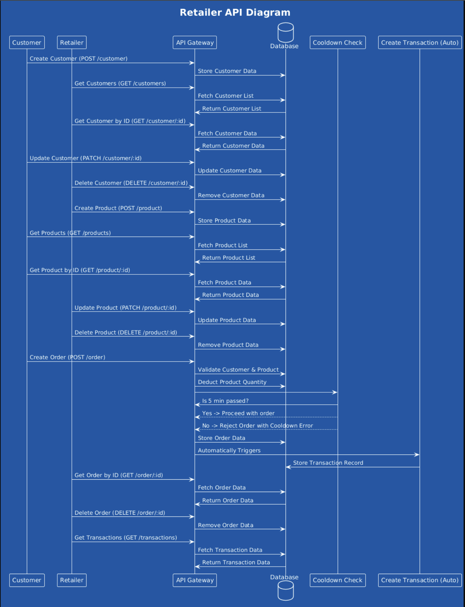

# Retailer Service API - Day 4 & 5

## Overview
This project is a service for a hypothetical retailer that manages products, orders, and transactions. The retailer can add products, update their price and quantity, and customers can place orders. The system also ensures a **5-minute cooldown period per customer** between orders.


## Architecture: MVC (Model-View-Controller)
This project follows the **MVC (Model-View-Controller)** architecture, which helps in organizing the codebase efficiently.

- **Models**: Defines the database schema and ORM mappings.
- **Controllers**: Handles business logic and request processing.
- **Routes**: Defines API routes and maps them to controllers.
- **Config**: Handles database connection and configuration.
- **Tests**: Contains unit tests for different services.
- **Utils**: Can include utility functions and helper methods.

---

## Project Directory Structure

```
DAY4_5_EXERCISE/
│── config/
│   ├── db.go                # Database connection setup
│
│── controllers/
│   ├── customer_controller.go    # Customer API logic
│   ├── order_controller.go       # Order API logic
│   ├── product_controller.go     # Product API logic
│   ├── transaction_controller.go # Transaction API logic
│
│── models/
│   ├── customer.go    # Customer model definition
│   ├── order.go       # Order model definition
│   ├── product.go     # Product model definition
│   ├── transaction.go # Transaction model definition
│
│── routes/
│   ├── customer_routes.go    # Customer API routes
│   ├── order_routes.go       # Order API routes
│   ├── product_routes.go     # Product API routes
│   ├── transaction_routes.go # Transaction API routes
│
│── tests/
│   ├── customer_test.go    # Unit tests for customer service
│   ├── mock_db.go         # Mocking database for tests
│   ├── order_test.go      # Unit tests for order service
│   ├── product_test.go    # Unit tests for product service
│   ├── transaction_test.go # Unit tests for transaction service
│
│── utils/                  # Utility functions (if needed)
│── .env                    # Environment variables
│── .gitignore               # Git ignore file
│── go.mod                   # Go module definition
│── go.sum                   # Go dependencies checksum
│── main.go                  # Application entry point
│── readme.md                # Project documentation
```

---

## Services Overview
Each service is designed to handle a specific functionality within the application.

### **1. Customer Service**
- Manages customers
- Allows creating, updating, deleting, and retrieving customers
- **Files**: `customer.go`, `customer_controller.go`, `customer_routes.go`

### **2. Product Service**
- Manages products available for sale
- Allows adding, updating, deleting, and retrieving products
- **Files**: `product.go`, `product_controller.go`, `product_routes.go`

### **3. Order Service**
- Handles customer orders
- Supports multiple products per order
- Implements a 5-minute cooldown for consecutive orders
- **Files**: `order.go`, `order_controller.go`, `order_routes.go`

### **4. Transaction Service**
- Manages business transactions and order history
- Allows the retailer to view all transactions
- **Files**: `transaction.go`, `transaction_controller.go`, `transaction_routes.go`

---

## **Database Schema**

### **1. Customers Table**
Stores customer information.

| Column     | Data Type     | Constraints                  | Description             |
|------------|-------------|------------------------------|-------------------------|
| id         | VARCHAR(255) | PRIMARY KEY                 | Unique customer ID      |
| name       | VARCHAR(255) | NOT NULL                    | Customer's name         |
| email      | VARCHAR(255) | UNIQUE, NOT NULL            | Customer's email        |
| created_at | TIMESTAMP    | DEFAULT CURRENT_TIMESTAMP   | Account creation time   |

---

### **2. Products Table**
Stores product details.

| Column       | Data Type     | Constraints                  | Description                |
|-------------|-------------|------------------------------|----------------------------|
| id          | VARCHAR(255) | PRIMARY KEY                 | Unique product ID          |
| product_name | VARCHAR(255) | NOT NULL                    | Name of the product        |
| price       | DECIMAL(10,2) | NOT NULL                    | Product price              |
| quantity    | INT           | NOT NULL                    | Available stock quantity   |

---

### **3. Orders Table**
Stores customer orders.

| Column      | Data Type     | Constraints                                     | Description               |
|------------|-------------|-------------------------------------------------|---------------------------|
| id         | VARCHAR(255) | PRIMARY KEY                                     | Unique order ID           |
| customer_id | VARCHAR(255) | FOREIGN KEY → customers(id)                     | Customer placing the order |
| total_price | DECIMAL(10,2) | NOT NULL                                       | Total order amount        |
| status     | ENUM('order placed', 'processed', 'failed') | DEFAULT 'order placed' | Order status              |
| created_at | TIMESTAMP    | DEFAULT CURRENT_TIMESTAMP                       | Order placement time      |

---

### **4. Order_Items Table**
Stores details of products within an order (supports multiple products per order).

| Column      | Data Type     | Constraints                    | Description                 |
|------------|-------------|--------------------------------|-----------------------------|
| id         | VARCHAR(255) | PRIMARY KEY                  | Unique order item ID        |
| order_id   | VARCHAR(255) | FOREIGN KEY → orders(id)     | Associated order            |
| product_id | VARCHAR(255) | FOREIGN KEY → products(id)   | Product in the order        |
| quantity   | INT           | NOT NULL                     | Quantity ordered            |
| price      | DECIMAL(10,2) | NOT NULL                     | Price of the product        |

---

### **5. Transactions Table**
Stores records of completed transactions.

| Column       | Data Type     | Constraints                  | Description                 |
|-------------|-------------|------------------------------|-----------------------------|
| id          | VARCHAR(255) | PRIMARY KEY                 | Unique transaction ID       |
| order_id    | VARCHAR(255) | FOREIGN KEY → orders(id)    | Associated order            |
| customer_id | VARCHAR(255) | FOREIGN KEY → customers(id) | Associated customer         |
| product_id  | VARCHAR(255) | FOREIGN KEY → products(id)  | Associated product          |
| quantity    | INT           | NOT NULL                    | Quantity purchased          |
| total_price | DECIMAL(10,2) | NOT NULL                    | Total transaction amount    |
| status      | ENUM('success', 'failed', 'pending') | NOT NULL    | Transaction status         |
| created_at  | TIMESTAMP    | DEFAULT CURRENT_TIMESTAMP   | Transaction timestamp       |


## Features
✅ Add, Update, Delete Products  
✅ View All Products  
✅ Place Orders (Supports multiple products per order)  
✅ View Order using ID
✅ Delete Order
✅ Retailer Transaction History  
✅ Create,Update and Delete Customer
✅ View Customer using ID
✅ View all Customers
✅ Mutex Locking for Update/Delete Requests  
✅ Concurrency Handling  
✅ Error Handling  
✅ Unit Testing  
✅ Panic Handling  

---

## Tech Stack
- **Golang** (Gin framework)
- **MySQL**
- **GORM** (ORM Library)
- **Postman** (API Testing)
- **Testify** (Unit Testing & Mocking)

---

## Setup Instructions
### 1. Clone the Repository
```sh
git clone <repository_url>
cd day4_5_exercise
```

### 2. Install Dependencies
```sh
go mod tidy
```

### 3. Configure the `.env` File
Create a `.env` file with the following:
```env
DB_HOST=localhost
DB_USER=root
DB_PASSWORD=root
DB_NAME=retailer_db
DB_PORT=3306
```

### 4. Run the Service
```sh
go run main.go
```

### 5. Run Unit Tests
```sh
go test ./tests
```

---

## API Endpoints & Testing
### 1. **Product APIs**
#### ➤ Add a Product
**POST** `/product`
```json
{
    "product_name": "bottle",
    "price": 50,
    "quantity": 40
}
```
Response:
```json
{
    "id": "PROD12345",
    "product_name": "bottle",
    "price": 50,
    "quantity": 40,
    "message": "product successfully added"
}
```

#### ➤ Update a Product
**PATCH** `/product/:id`
```json
{
    "price": 60,
    "quantity": 4
}
```

#### ➤ Get Product by ID
**GET** `/product/:id`

#### ➤ Get All Products
**GET** `/products`

#### ➤ Delete a Product
**DELETE** `/product/:id`

---

### 2. **Order APIs**
#### ➤ Place an Order
**POST** `/order`
```json
{
    "customer_id": "CST12345",
    "items": [
        {
            "product_id": "PROD12345",
            "quantity": 1
        }
    ]
}
```

#### ➤ Get Order by ID
**GET** `/order/:id`

#### ➤ Delete an Order
**DELETE** `/order/:id`

⚠️ **Cooldown:** Customers can place only one order every **5 minutes**.

---

### 3. **Customer APIs**
#### ➤ Create a Customer
**POST** `/customer`
```json
{
  "name": "Rahul Sharma",
  "email": "rahul@gmail.com"
}
```

#### ➤ Get Customer by ID
**GET** `/customer/:id`

#### ➤ Get All Customers
**GET** `/customers`

#### ➤ Update Customer
**PATCH** `/customer/:id`

#### ➤ Delete Customer
**DELETE** `/customer/:id`

---

### 4. **Transaction APIs**
#### ➤ Get Transaction History
**GET** `/transactions`

---




## Author
👨‍💻 **Raghav Sharma**  
📧 **sharma.raghav@razorpay.com**

